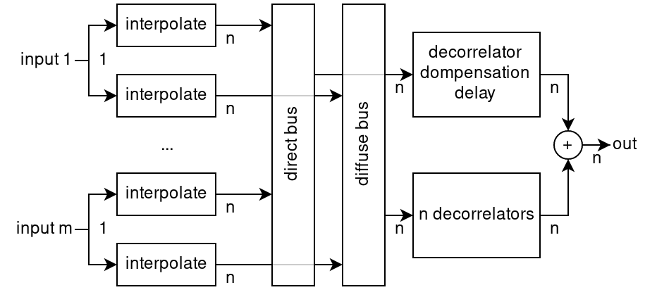

.. cpp:namespace:: ear::dsp

DSP
===

This library does not provide complete DSP paths to render ADM content, but
does contain some components which can be used to do so. DSP components are
defined in :ref:`namespace_ear__dsp`.

FFT interface
~~~~~~~~~~~~~

:class:`BlockConvolver` objects use a user-provided FFT implementation. These
are provided by implementing :class:`FFTImpl\<float><template <typename Real>
FFTImpl>` (and therefore :class:`FFTPlan\<float><template <typename Real>
FFTPlan>` and :class:`FFTWorkBuf`) for the FFT library you wish to use, and
passing an instance to :func:`BlockConvolver::Context::Context`.

An implementation for KISS FFT is provided by default, and may be obtained by
calling :func:`get_fft_kiss`. The implementation of this (in
``src/fft_kiss.cpp``) may be a useful example to show how the FFT interface
should be implemented.

Rendering DirectSpeakers
~~~~~~~~~~~~~~~~~~~~~~~~

The gains calculated for ``DirectSpeakers`` channels using the
:class:`GainCalculatorDirectSpeakers` should be applied directly to the input
audio channel to produce the output audio channels. ``DirectSpeakers`` metadata
should not be dynamic (there should be a single ``audioBlockFormat`` in each
``audioChannelFormat``), so gains should not be interpolated inside blocks, though
should be interpolated if metadata is changed by the user.

This may be applied using
the :class:`GainInterpolator<template <typename InterpType> GainInterpolator>` with
:class:`LinearInterpVector`.

.. _dsp_objects:

Rendering Objects
~~~~~~~~~~~~~~~~~

The audio processing for Objects content is defined in :cite:`bs2127` section
7.1. The structure used is as in :numref:`objects`.

.. _objects:

   Signal processing for m Objects with n output channels

This can be built from the following components:

- :class:`GainInterpolator<template <typename InterpType> GainInterpolator>` with
  :class:`LinearInterpVector` to interpolate and apply the gains to the
  incoming audio (the *interp* blocks in :numref:`objects`).

- :class:`DelayBuffer\<float><template <typename T> DelayBuffer>` with
  :func:`decorrelatorCompensationDelay` samples delay to compensate for the
  decorrelator delays.

- :class:`BlockConvolver` objects with filters calculated using
  :func:`designDecorrelators` to decorrelate the signals.

- :class:`VariableBlockSizeAdapter\<float><template <typename SampleType>
  VariableBlockSizeAdapter>` to allow the use of :class:`BlockConvolver`
  objects with variable-size sample blocks. This could be used to wrap just the
  :func:`BlockConvolver::process` calls, or the whole processing chain
  (recommended). If only the block convolvers are adapted, then the
  compensation delay will need to be increased by
  :func:`VariableBlockSizeAdapter::get_delay` samples.

Rendering HOA
~~~~~~~~~~~~~

As with ``DirectSpeakers``, ``HOA`` metadata should not be dynamic, so the calculated matrices can be applied directly to the input audio.

The decode matrices calculated for ``HOA`` channels using the
:class:`GainCalculatorHOA` should be applied directly to the input audio
channels to produce the output audio channels. As with ``DirectSpeakers``,
``HOA`` metadata should not be dynamic (there should be a single
``audioBlockFormat`` in each ``audioChannelFormat``), so gains should not be
interpolated inside blocks, though should be interpolated if metadata is
changed by the user.

This may be applied using
the :class:`GainInterpolator<template <typename InterpType> GainInterpolator>` with
:class:`LinearInterpMatrix`.
